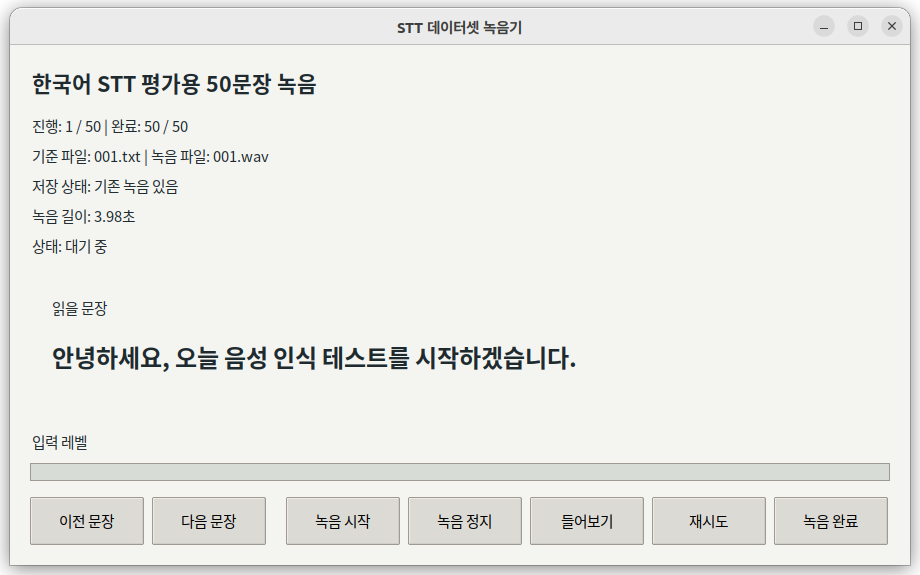
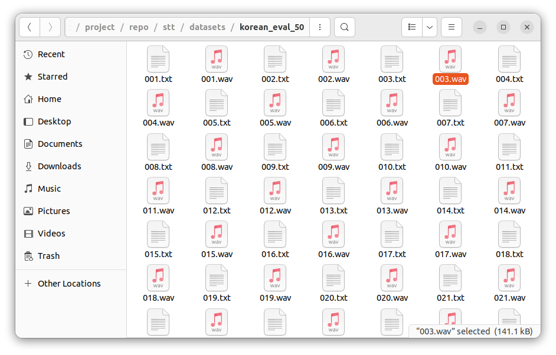

# STT

이 디렉토리는 speech-to-text 계층 자리다.

현재 상태:

- 초기 구현 완료
- 온디바이스와 API 기반 STT를 같은 사용법으로 갈아끼울 수 있는 구조를 잡았다.
- 고정 문장 50개 기준 녹음 데이터셋과 비교 평가 흐름을 추가했다.

예상 역할:

- 발화 오디오를 텍스트로 변환
- Jetson 환경과 서버/API 환경을 모두 고려한 추상화 제공

현재 구현 구조:

- `transcriber.py`
  - 공통 진입점
  - `STTTranscriber(model="whisper" | "api")`
- `stt_whisper.py`
  - OpenAI Whisper 기반 온디바이스 백엔드
- `stt_api.py`
  - OpenAI Audio Transcriptions API 백엔드
- `tools/stt_demo.py`
  - 기본 마이크 또는 wav 파일을 받아 텍스트를 출력하는 최소 데모
- `tools/stt_dataset_recorder.py`
  - 기준 문장 50개를 순서대로 녹음하는 GUI
- `tools/stt_benchmark.py`
  - 같은 데이터셋으로 여러 STT 설정을 비교하는 평가 스크립트
- `tools/stt_eval_overview.py`
  - 평가 결과 디렉토리에서 overview 문서를 다시 생성하는 스크립트
- `experiments/stt_trt_builder_experiment.py`
  - WhisperTRT split builder 실험 스크립트
- `experiments/stt_trt_benchmark_experiment.py`
  - WhisperTRT 한국어 checkpoint를 50문장 세트로 평가하는 실험 스크립트
- `datasets/korean_eval_50/`
  - txt와 wav를 같은 파일명으로 관리하는 평가 세트
- `models/whisper_trt_base_ko_ctx64/`
  - 현재 승격된 한국어 WhisperTRT base 로컬 artifact 경로와 평가 스냅샷

공통 사용 방식:

```python
from stt import STTTranscriber

transcriber = STTTranscriber(model="whisper", model_name="tiny")
text = transcriber.transcribe(audio)
print(text)
print(transcriber.last_duration_sec)
```

현재 v1 기준:

- 기본 온디바이스 backend는 `whisper`
- 기본 Whisper 모델값은 현재 `tiny` 잠정값
- API backend는 구조만 같이 맞춰 둠
- 입력은 `16kHz mono` wav 또는 float32 mono 배열 기준
- 현재 단계의 목적은 `짧은 utterance -> text` 기본 경로 확보와 비교 평가 기준 마련이다
- 기본 모델값은 감으로 정하지 않고, 직접 녹음한 50문장 세트로 속도와 정확도를 비교한 뒤 정한다
- 현재 기본 후보는 `Whisper base (PyTorch + CUDA)`이며, `WhisperTRT base` 한국어 경로는 별도 실험 중이다

## 디렉토리 역할

- 루트 `stt/`
  - 실제 런타임 코드
- `stt/tools/`
  - 반복 실행하는 데모, 녹음기, benchmark, overview 재생성 도구
- `stt/experiments/`
  - TRT처럼 실험성 경로를 확인하는 코드
- `stt/datasets/`
  - 평가 기준 데이터셋
- `stt/eval_results/`
  - code-generated 평가 산출물
- `stt/models/`
  - 메인 모델 자산 또는 로컬 재현용 artifact 경로

## 평가 데이터셋

- 경로: `stt/datasets/korean_eval_50/`
- 파일 구조:
  - `001.txt`
  - `001.wav`
  - `002.txt`
  - `002.wav`
- txt와 사용자가 직접 녹음한 wav를 모두 리포에 포함한다.
- 현재 한국어 50문장 직접 녹음 세트는 평가 기준 자산으로 함께 관리한다.

이 구조를 택한 이유:

- 문장 기준과 녹음 결과가 1:1로 바로 대응된다.
- 사람이 폴더를 열어도 진행 상태를 즉시 이해할 수 있다.
- recorder와 benchmark가 같은 포맷을 그대로 사용한다.

## 데이터셋 제작 화면

| Recorder GUI | 저장된 데이터셋 |
|---|---|
|  |  |

왼쪽은 기준 문장을 순서대로 읽으며 `녹음 시작 / 녹음 정지 / 들어보기 / 재시도 / 녹음 완료`를 수행하는 GUI다.  
오른쪽은 실제 저장 결과이며, 같은 번호의 `txt + wav`가 한 쌍으로 관리된다.

## 녹음 GUI

```bash
cd /home/everybot/workspace/ondevice-voice-agent/project/repo
source /home/everybot/workspace/ondevice-voice-agent/project/env/wake_word_train_smoke/bin/activate
python stt/tools/stt_dataset_recorder.py --dataset-dir stt/datasets/korean_eval_50
```

현재 지원 버튼:

- `녹음 시작`
- `녹음 정지`
- `들어보기`
- `재시도`
- `녹음 완료`

`녹음 완료`를 누르면 현재 문장 번호의 wav를 저장하고 다음 문장으로 자동 이동한다.

## 직접 실행 안내

직접 평가를 돌릴 때는 아래 순서대로 보면 된다.

### 1. 사용할 가상환경

- 경로: `/home/everybot/workspace/ondevice-voice-agent/project/env/wake_word_train_smoke`
- 용도:
  - `torch`
  - `openai-whisper`
  - `openai`
  - `librosa`
  - STT smoke / benchmark 실행

활성화:

```bash
cd /home/everybot/workspace/ondevice-voice-agent/project/repo
source /home/everybot/workspace/ondevice-voice-agent/project/env/wake_word_train_smoke/bin/activate
```

### 2. 녹음 데이터셋 만들기

```bash
python stt/tools/stt_dataset_recorder.py --dataset-dir stt/datasets/korean_eval_50
```

필요 시 시작 문장을 지정할 수 있다.

```bash
python stt/tools/stt_dataset_recorder.py \
  --dataset-dir stt/datasets/korean_eval_50 \
  --start-index 21
```

오디오 장치를 먼저 보고 싶으면:

```bash
python stt/tools/stt_dataset_recorder.py --list-devices
```

### 3. 로컬 Whisper 비교 평가

Jetson GPU 기준 기본 비교:

```bash
python stt/tools/stt_benchmark.py \
  --dataset-dir stt/datasets/korean_eval_50 \
  --config whisper:tiny \
  --config whisper:base \
  --config whisper:small \
  --device cuda
```

CPU로만 보고 싶으면:

```bash
python stt/tools/stt_benchmark.py \
  --dataset-dir stt/datasets/korean_eval_50 \
  --config whisper:tiny \
  --device cpu
```

### 4. API STT 비교 평가

`secrets/api_key.txt`가 있으면 별도 `--api-key` 없이 실행할 수 있다.

```bash
python stt/tools/stt_benchmark.py \
  --dataset-dir stt/datasets/korean_eval_50 \
  --config api:gpt-4o-mini-transcribe \
  --usage-purpose stt_eval_korean50_gpt4o_mini
```

API는 과금이 발생하므로 꼭 필요한 횟수만 실행한다.

### 5. 결과 확인

- 저장 위치: `stt/eval_results/<dataset_name>/<timestamp>/`
- 생성 파일:
  - `summary.csv`
  - `summary.json`
  - `<run_name>_per_sample.csv`

### 7. WhisperTRT 한국어 실험

WhisperTRT 실험은 기존 smoke env가 아니라 별도 env에서 돌린다.

- env: `/home/everybot/workspace/ondevice-voice-agent/project/env/stt_trt_experiment`
- builder 실험:

```bash
cd /home/everybot/workspace/ondevice-voice-agent/project/repo
source /home/everybot/workspace/ondevice-voice-agent/project/env/stt_trt_experiment/bin/activate
python stt/experiments/stt_trt_builder_experiment.py \
  --step run \
  --model-name base \
  --language ko \
  --workspace-mb 128 \
  --max-text-ctx 64 \
  --work-dir /home/everybot/workspace/ondevice-voice-agent/project/results/stt_trt_split_base_ko_ctx64_ws128
```

- benchmark:

```bash
cd /home/everybot/workspace/ondevice-voice-agent/project/repo
source /home/everybot/workspace/ondevice-voice-agent/project/env/stt_trt_experiment/bin/activate
python stt/experiments/stt_trt_benchmark_experiment.py \
  --checkpoint /home/everybot/workspace/ondevice-voice-agent/project/repo/stt/models/whisper_trt_base_ko_ctx64/whisper_trt_split.pth \
  --model-name base \
  --language ko \
  --workspace-mb 128 \
  --max-text-ctx 64
```

현재 승격 경로는 아래다.

- `/home/everybot/workspace/ondevice-voice-agent/project/repo/stt/models/whisper_trt_base_ko_ctx64/whisper_trt_split.pth`

다만 이 `.pth`는 파일 크기 때문에 git에 올리지 않고, 로컬에서만 생성/보관한다. 이 경로를 다시 만들고 싶으면 아래 순서대로 재현하면 된다.

1. split builder로 checkpoint 생성
```bash
cd /home/everybot/workspace/ondevice-voice-agent/project/repo
source /home/everybot/workspace/ondevice-voice-agent/project/env/stt_trt_experiment/bin/activate
python stt/experiments/stt_trt_builder_experiment.py \
  --step run \
  --model-name base \
  --language ko \
  --workspace-mb 128 \
  --max-text-ctx 64 \
  --work-dir /home/everybot/workspace/ondevice-voice-agent/project/results/stt_trt_split_base_ko_ctx64_ws128
```

2. 생성한 checkpoint를 메인 로컬 경로로 복사
```bash
mkdir -p /home/everybot/workspace/ondevice-voice-agent/project/repo/stt/models/whisper_trt_base_ko_ctx64
cp /home/everybot/workspace/ondevice-voice-agent/project/results/stt_trt_split_base_ko_ctx64_ws128/whisper_trt_split.pth \
  /home/everybot/workspace/ondevice-voice-agent/project/repo/stt/models/whisper_trt_base_ko_ctx64/whisper_trt_split.pth
```

3. benchmark 재실행
```bash
cd /home/everybot/workspace/ondevice-voice-agent/project/repo
source /home/everybot/workspace/ondevice-voice-agent/project/env/stt_trt_experiment/bin/activate
python stt/experiments/stt_trt_benchmark_experiment.py \
  --checkpoint /home/everybot/workspace/ondevice-voice-agent/project/repo/stt/models/whisper_trt_base_ko_ctx64/whisper_trt_split.pth \
  --model-name base \
  --language ko \
  --workspace-mb 128 \
  --max-text-ctx 64
```

즉 레포에는 재현 코드와 요약 스냅샷만 남기고, 대용량 checkpoint는 각 개발 환경에서 다시 만든다. 현 시점 수치 기준으로는 속도는 더 빠르지만 정확도는 PyTorch `base(cuda)`보다 약간 불리해, 기본값 전환은 아직 하지 않았다.

### 6. API 사용 로그 확인

- 키 위치: `secrets/api_key.txt`
- 사용 로그: `secrets/api_usage_log.md`

API를 실제 호출하면 아래 항목이 자동으로 남는다.

- 사용 시각
- 사용 목적
- 모델 이름
- 성공/실패 여부
- 오디오 길이
- 요청 시간
- API가 보고한 usage 값

## 비교 평가

```bash
cd /home/everybot/workspace/ondevice-voice-agent/project/repo
source /home/everybot/workspace/ondevice-voice-agent/project/env/wake_word_train_smoke/bin/activate
python stt/tools/stt_benchmark.py \
  --dataset-dir stt/datasets/korean_eval_50 \
  --config whisper:tiny \
  --config whisper:base \
  --config whisper:small \
  --device cuda
```

현재 비교 지표:

- 샘플별 전사 결과
- 샘플별 STT 시간
- 설정별 평균 처리 시간
- 설정별 normalized exact match
- 설정별 normalized CER

평가 결과는 `stt/eval_results/` 아래에 저장한다.
- 샘플별 GT/예측 비교는 `<run_name>_readable.md`에 사람이 읽기 쉬운 형태로 저장한다.
- 실행별 요약 표는 `summary.csv`, `summary.json`, `summary.md`로 함께 저장한다.

API STT 실행 메모:

- `--api-key`를 주지 않으면 로컬 `secrets/api_key.txt`를 먼저 찾는다.
- API를 실제 호출하면 로컬 `secrets/api_usage_log.md`에 사용 목적, 모델, 오디오 길이, 요청 시간, API가 보고한 usage 값이 자동으로 기록된다.
- 현재 Audio Transcriptions API는 일반 텍스트 토큰 수 대신 `usage.seconds` 형태의 사용량을 보고한다.

현재 참고 기준:

- [`../docs/개발방침.md`](../docs/개발방침.md)
- [`../docs/project_overview.md`](../docs/project_overview.md)
