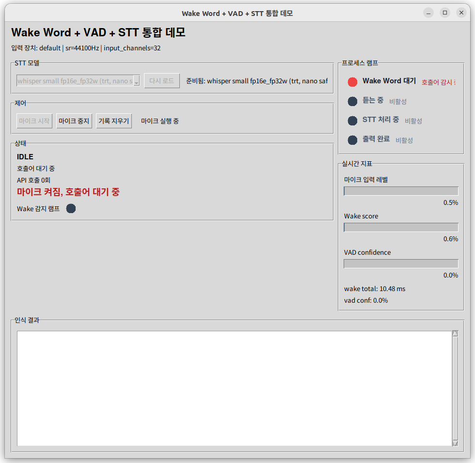
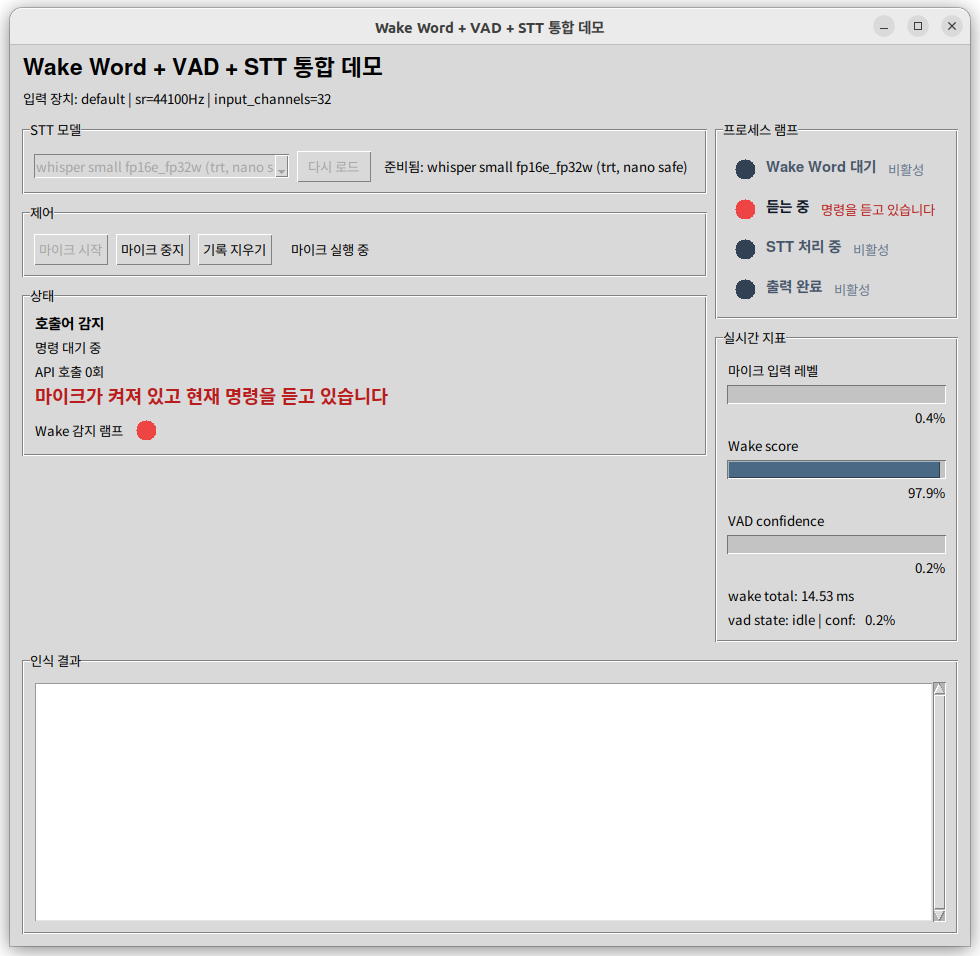
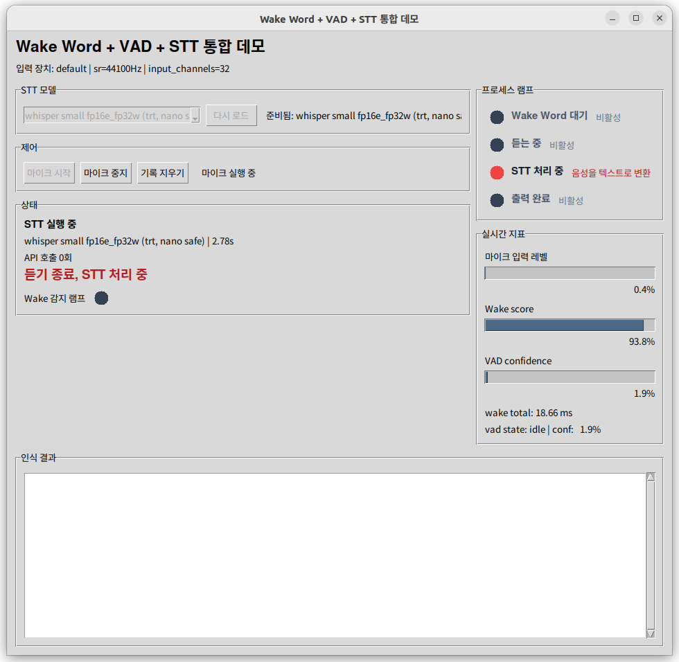
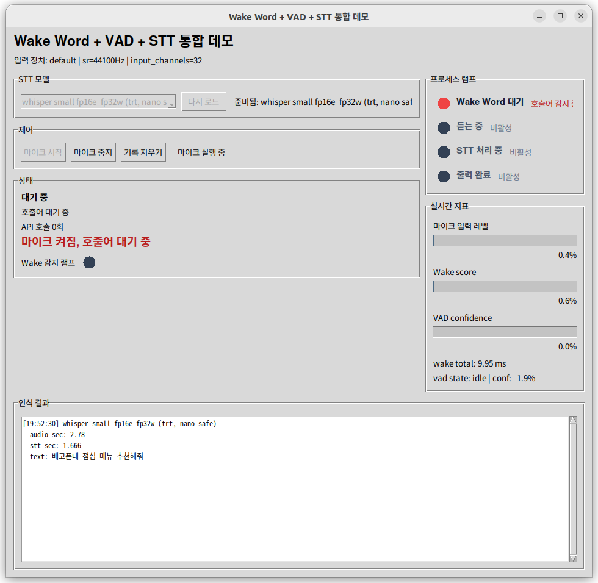
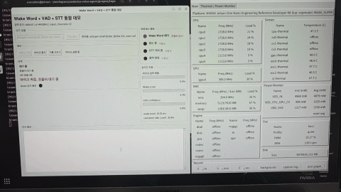
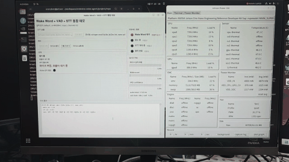

# STT

이 디렉토리는 speech-to-text 계층 자리다.

현재 상태:

- 초기 구현 완료
- 온디바이스와 API 기반 STT를 같은 사용법으로 갈아끼울 수 있는 구조를 잡았다.
- 고정 문장 50개 기준 녹음 데이터셋과 비교 평가 흐름을 추가했다.
- 현재 기본 후보 판단과 상위 진행 상태는 `docs/status.md`를 기준으로 보고, 이 문서는 STT 디렉토리 구조와 재현 절차만 담당한다.

예상 역할:

- 발화 오디오를 텍스트로 변환
- Jetson 환경과 서버/API 환경을 모두 고려한 추상화 제공

현재 구현 구조:

- `transcriber.py`
  - 공통 진입점
  - `STTTranscriber(model="whisper" | "api")`
- `stt_whisper.py`
  - OpenAI Whisper 기반 온디바이스 백엔드
- `stt_api.py`
  - OpenAI Audio Transcriptions API 백엔드
- `tools/stt_demo.py`
  - 기본 마이크 또는 wav 파일을 받아 텍스트를 출력하는 최소 데모
- `tools/stt_dataset_recorder.py`
  - 기준 문장 50개를 순서대로 녹음하는 GUI
- `tools/stt_benchmark.py`
  - 같은 데이터셋으로 여러 STT 설정을 비교하는 평가 스크립트
- `tools/stt_eval_overview.py`
  - 평가 결과 디렉토리에서 overview 문서를 다시 생성하는 스크립트
- `tools/stt_gui_demo.py`
  - 녹음 시작 / 정지와 모델 전환을 GUI로 확인하는 STT 시연 도구
- `experiments/stt_trt_builder_experiment.py`
  - WhisperTRT split builder 실험 스크립트
- `experiments/stt_trt_benchmark_experiment.py`
  - WhisperTRT 한국어 checkpoint를 50문장 세트로 평가하는 실험 스크립트
- `datasets/korean_eval_50/`
  - txt와 wav를 같은 파일명으로 관리하는 평가 세트
- `models/whisper_trt_base_ko_ctx64_fp16e_fp16w_legacy/`
  - 기존 base TRT artifact 경로
- `models/whisper_trt_small_ko_ctx64_fp16e_fp32w_nano_safe/`
  - Orin Nano 기준 safe small TRT artifact 경로
- `models/whisper_trt_small_ko_ctx64_fp16e_fp32w_agx_cross_device/`
  - AGX Orin 기준 교차 장치 확인 메모 경로

공통 사용 방식:

```python
from stt import STTTranscriber

transcriber = STTTranscriber(model="whisper", model_name="tiny")
text = transcriber.transcribe(audio)
print(text)
print(transcriber.last_duration_sec)
```

현재 v1 기준:

- 기본 온디바이스 backend는 `whisper`
- 기본 Whisper 모델값은 현재 `tiny` 잠정값
- API backend는 구조만 같이 맞춰 둠
- 입력은 `16kHz mono` wav 또는 float32 mono 배열 기준
- 현재 단계의 목적은 `짧은 utterance -> text` 기본 경로 확보와 비교 평가 기준 마련이다
- 기본 모델값은 감으로 정하지 않고, 직접 녹음한 50문장 세트로 속도와 정확도를 비교한 뒤 정한다
- 현재 추천 판단과 전체 우선순위는 `docs/status.md`, 정량 비교표는 `docs/reports/stt_korean_eval50_overview.md`를 기준으로 본다.

## 모델 자산 역할

| 경로 | 의미 | 보관 정책 |
|---|---|---|
| `models/whisper_trt_base_ko_ctx64_fp16e_fp16w_legacy/` | 기존 한국어 `base` TRT 자산 | 로컬 체크포인트 유지 가능, git 비추적 |
| `models/whisper_trt_small_ko_ctx64_fp16e_fp32w_nano_safe/` | Orin Nano 8GB에서 직접 생성한 safe `small` TRT 자산 | 운영/재현용 로컬 체크포인트 유지 |
| `models/whisper_trt_small_ko_ctx64_fp16e_fp32w_agx_cross_device/` | AGX Orin에서 빌드했던 교차 장치 확인 기준 | 문서만 유지, checkpoint 상시 보관 대상 아님 |

`small nano safe` 기준:

- 엔진 dtype: `fp16`
- 빌드 가중치 dtype: `fp32`
- `decoder chunk 2`
- `encoder chunk 1`
- `workspace 64MB`
- `max_text_ctx 64`

## 디렉토리 역할

- 루트 `stt/`
  - 실제 런타임 코드
- `stt/tools/`
  - 반복 실행하는 데모, 녹음기, benchmark, overview 재생성 도구
- `stt/experiments/`
  - TRT처럼 실험성 경로를 확인하는 코드
- `stt/datasets/`
  - 평가 기준 데이터셋
- `stt/eval_results/`
  - code-generated 평가 산출물
- `stt/models/`
  - 메인 모델 자산 또는 로컬 재현용 artifact 경로

## 평가 데이터셋

- 경로: `stt/datasets/korean_eval_50/`
- 파일 구조:
  - `001.txt`
  - `001.wav`
  - `002.txt`
  - `002.wav`
- txt와 사용자가 직접 녹음한 wav를 모두 리포에 포함한다.
- 현재 한국어 50문장 직접 녹음 세트는 평가 기준 자산으로 함께 관리한다.

이 구조를 택한 이유:

- 문장 기준과 녹음 결과가 1:1로 바로 대응된다.
- 사람이 폴더를 열어도 진행 상태를 즉시 이해할 수 있다.
- recorder와 benchmark가 같은 포맷을 그대로 사용한다.

## 데이터셋 제작 화면

| Recorder GUI | 저장된 데이터셋 |
|---|---|
|  |  |

왼쪽은 기준 문장을 순서대로 읽으며 `녹음 시작 / 녹음 정지 / 들어보기 / 재시도 / 녹음 완료`를 수행하는 GUI다.  
오른쪽은 실제 저장 결과이며, 같은 번호의 `txt + wav`가 한 쌍으로 관리된다.

## 녹음 GUI

```bash
cd /home/everybot/workspace/ondevice-voice-agent/repo
source /home/everybot/workspace/ondevice-voice-agent/env/wake_word_train_smoke/bin/activate
python stt/tools/stt_dataset_recorder.py --dataset-dir stt/datasets/korean_eval_50
```

현재 지원 버튼:

- `녹음 시작`
- `녹음 정지`
- `들어보기`
- `재시도`
- `녹음 완료`

`녹음 완료`를 누르면 현재 문장 번호의 wav를 저장하고 다음 문장으로 자동 이동한다.

## 직접 실행 안내

직접 평가를 돌릴 때는 아래 순서대로 보면 된다.

### 1. 사용할 가상환경

- 경로: `/home/everybot/workspace/ondevice-voice-agent/env/wake_word_train_smoke`
- 용도:
  - `torch`
  - `openai-whisper`
  - `openai`
  - `librosa`
  - STT smoke / benchmark 실행

활성화:

```bash
cd /home/everybot/workspace/ondevice-voice-agent/repo
source /home/everybot/workspace/ondevice-voice-agent/env/wake_word_train_smoke/bin/activate
```

STT GUI에서 `tiny/base(cuda)`, `base(trt)`, `api`를 한 번에 다루려면 아래 env를 권장한다.

- `/home/everybot/workspace/ondevice-voice-agent/env/stt_trt_experiment`

### 2. 녹음 데이터셋 만들기

```bash
python stt/tools/stt_dataset_recorder.py --dataset-dir stt/datasets/korean_eval_50
```

필요 시 시작 문장을 지정할 수 있다.

```bash
python stt/tools/stt_dataset_recorder.py \
  --dataset-dir stt/datasets/korean_eval_50 \
  --start-index 21
```

오디오 장치를 먼저 보고 싶으면:

```bash
python stt/tools/stt_dataset_recorder.py --list-devices
```

### 2-1. STT GUI 데모

```bash
cd /home/everybot/workspace/ondevice-voice-agent/repo
source /home/everybot/workspace/ondevice-voice-agent/env/stt_trt_experiment/bin/activate
python stt/tools/stt_gui_demo.py
```

현재 GUI 데모 특징:

- `녹음 시작 / 녹음 정지 / 기록 지우기`
- `정지 후 4개 모델 전체 비교` 체크박스
- 모델 선택 드롭다운
  - `whisper tiny fp16 (cuda)`
  - `whisper base fp16 (cuda)`
  - `whisper base fp16e_fp16w (trt, legacy)`
  - `whisper small fp16e_fp32w (trt, nano safe)`
  - `gpt-4o-mini-transcribe (api)`
- 모델 전환은 백그라운드 로딩으로 처리
- 전사 결과는 스크롤 가능한 히스토리로 저장
- API는 경고 문구와 세션 호출 횟수를 표시

### 2-2. Wake Word + VAD + STT 통합 GUI 데모

```bash
cd /home/everybot/workspace/ondevice-voice-agent/repo
source /home/everybot/workspace/ondevice-voice-agent/env/stt_trt_experiment/bin/activate
python voice_pipeline_gui_demo.py
```

이 데모는 기존 `wake_word`, `vad`, `stt` 모듈을 그대로 묶어, 호출어 감지부터 발화 구간 검출, STT 결과 표시까지 한 화면에서 확인하는 용도다.

현재 화면 구성:

- 왼쪽: STT 모델 선택, 마이크 시작/중지, 현재 상태 문구
- 오른쪽: 프로세스 램프와 실시간 지표
- 아래: 전사 결과 히스토리

프로세스 램프 단계:

- `Wake Word 대기`
- `듣는 중`
- `STT 처리 중`
- `출력 완료`

청취 상태는 상단 강조 문구로 함께 표시한다.

- `마이크 켜짐, 호출어 대기 중`
- `마이크가 켜져 있고 현재 명령을 듣고 있습니다`
- `듣기 종료, STT 처리 중`
- `처리 완료, 다시 호출어 대기`

화면 예시는 아래 순서로 본다.

| 대기 상태 | 호출어 감지 후 듣는 중 |
|---|---|
|  |  |

| STT 처리 중 | 출력 완료 |
|---|---|
|  |  |

시연 영상은 아래 GIF 썸네일을 클릭해서 본다.

| Demo 1 | Demo 2 |
|---|---|
| [](../docs/assets/videos/jetson_demos/voice_pipeline_demo_01_giraffe_question.mp4) | [](../docs/assets/videos/jetson_demos/voice_pipeline_demo_02_lunch_recommendation.mp4) |

- Demo 1 발화: `내가 그린 기린 그림은 잘 그린 기린 그림이냐`
- Demo 2 발화: `배고픈데 점심 메뉴 추천해줘`

이 데모에서 확인할 수 있는 점:

- wake word threshold 기준으로 호출어가 감지되는지
- wake 이후 VAD가 실제 발화 구간만 수집하는지
- 발화 종료 후 STT가 어떤 모델로 얼마만에 끝나는지
- 최종 텍스트가 히스토리에 누적되는지

현재 통합 GUI는 먼저 데모 레이어에서 세 모듈을 연결한 상태다. SDK형 orchestrator 리팩토링은 아직 적용하지 않았고, 실제 사용성 검증 후 별도 논의 대상으로 둔다.

### 3. 로컬 Whisper 비교 평가

Jetson GPU 기준 기본 비교:

```bash
python stt/tools/stt_benchmark.py \
  --dataset-dir stt/datasets/korean_eval_50 \
  --config whisper:tiny \
  --config whisper:base \
  --config whisper:small \
  --device cuda
```

CPU로만 보고 싶으면:

```bash
python stt/tools/stt_benchmark.py \
  --dataset-dir stt/datasets/korean_eval_50 \
  --config whisper:tiny \
  --device cpu
```

### 4. API STT 비교 평가

리포 바깥 `../secrets/api_key.txt`가 있으면 별도 `--api-key` 없이 실행할 수 있다.

```bash
python stt/tools/stt_benchmark.py \
  --dataset-dir stt/datasets/korean_eval_50 \
  --config api:gpt-4o-mini-transcribe \
  --usage-purpose stt_eval_korean50_gpt4o_mini
```

API는 과금이 발생하므로 꼭 필요한 횟수만 실행한다.

### 5. 결과 확인

- 저장 위치: `stt/eval_results/<dataset_name>/<timestamp>/`
- 생성 파일:
  - `summary.csv`
  - `summary.json`
  - `<run_name>_per_sample.csv`

### 7. WhisperTRT 한국어 실험

WhisperTRT 실험은 기존 smoke env가 아니라 별도 env에서 돌린다.

- env: `/home/everybot/workspace/ondevice-voice-agent/env/stt_trt_experiment`
- AGX Orin에서 codex로 동일 작업할 때는 [`docs/envs/jetson/stt_trt_agx_orin_experiment.md`](../docs/envs/jetson/stt_trt_agx_orin_experiment.md) 우선 참조
- builder 실험:

```bash
cd /home/everybot/workspace/ondevice-voice-agent/repo
source /home/everybot/workspace/ondevice-voice-agent/env/stt_trt_experiment/bin/activate
python stt/experiments/stt_trt_builder_experiment.py \
  --step run \
  --model-name base \
  --language ko \
  --workspace-mb 128 \
  --max-text-ctx 64 \
  --work-dir /home/everybot/workspace/ondevice-voice-agent/results/stt_trt_split_base_ko_ctx64_ws128
```

- benchmark:

```bash
cd /home/everybot/workspace/ondevice-voice-agent/repo
source /home/everybot/workspace/ondevice-voice-agent/env/stt_trt_experiment/bin/activate
python stt/experiments/stt_trt_benchmark_experiment.py \
  --checkpoint /home/everybot/workspace/ondevice-voice-agent/repo/stt/models/whisper_trt_base_ko_ctx64_fp16e_fp16w_legacy/whisper_trt_split.pth \
  --model-name base \
  --language ko \
  --workspace-mb 128 \
  --max-text-ctx 64
```

현재 로컬 승격 경로는 아래다.

- `/home/everybot/workspace/ondevice-voice-agent/repo/stt/models/whisper_trt_base_ko_ctx64_fp16e_fp16w_legacy/whisper_trt_split.pth`
- `/home/everybot/workspace/ondevice-voice-agent/repo/stt/models/whisper_trt_small_ko_ctx64_fp16e_fp32w_nano_safe/whisper_trt_split.pth`

이 `.pth`들은 파일 크기 때문에 git에 올리지 않고, 로컬에서만 생성/보관한다. 다시 만들고 싶으면 아래 순서대로 재현하면 된다.

1. split builder로 checkpoint 생성
```bash
cd /home/everybot/workspace/ondevice-voice-agent/repo
source /home/everybot/workspace/ondevice-voice-agent/env/stt_trt_experiment/bin/activate
python stt/experiments/stt_trt_builder_experiment.py \
  --step run \
  --model-name base \
  --language ko \
  --workspace-mb 128 \
  --max-text-ctx 64 \
  --work-dir /home/everybot/workspace/ondevice-voice-agent/results/stt_trt_split_base_ko_ctx64_ws128
```

2. 생성한 checkpoint를 메인 로컬 경로로 복사
```bash
mkdir -p /home/everybot/workspace/ondevice-voice-agent/repo/stt/models/whisper_trt_base_ko_ctx64_fp16e_fp16w_legacy
cp /home/everybot/workspace/ondevice-voice-agent/results/stt_trt_split_base_ko_ctx64_ws128/whisper_trt_split.pth \
  /home/everybot/workspace/ondevice-voice-agent/repo/stt/models/whisper_trt_base_ko_ctx64_fp16e_fp16w_legacy/whisper_trt_split.pth
```

3. benchmark 재실행
```bash
cd /home/everybot/workspace/ondevice-voice-agent/repo
source /home/everybot/workspace/ondevice-voice-agent/env/stt_trt_experiment/bin/activate
python stt/experiments/stt_trt_benchmark_experiment.py \
  --checkpoint /home/everybot/workspace/ondevice-voice-agent/repo/stt/models/whisper_trt_base_ko_ctx64_fp16e_fp16w_legacy/whisper_trt_split.pth \
  --model-name base \
  --language ko \
  --workspace-mb 128 \
  --max-text-ctx 64
```

즉 레포에는 재현 코드와 요약 스냅샷만 남기고, 대용량 checkpoint는 각 개발 환경에서 다시 만든다. AGX Orin 교차 장치 확인용 `small`은 문서 기준만 남기고 checkpoint 자체는 상시 보관 대상으로 두지 않는다.

### 6. API 사용 로그 확인

- 키 위치: `../secrets/api_key.txt`
- 사용 로그: `../secrets/api_usage_log.md`

API를 실제 호출하면 아래 항목이 자동으로 남는다.

- 사용 시각
- 사용 목적
- 모델 이름
- 성공/실패 여부
- 오디오 길이
- 요청 시간
- API가 보고한 usage 값

## 비교 평가

```bash
cd /home/everybot/workspace/ondevice-voice-agent/repo
source /home/everybot/workspace/ondevice-voice-agent/env/wake_word_train_smoke/bin/activate
python stt/tools/stt_benchmark.py \
  --dataset-dir stt/datasets/korean_eval_50 \
  --config whisper:tiny \
  --config whisper:base \
  --config whisper:small \
  --device cuda
```

현재 비교 지표:

- 샘플별 전사 결과
- 샘플별 STT 시간
- 설정별 평균 처리 시간
- 설정별 normalized exact match
- 설정별 normalized CER

평가 결과는 `stt/eval_results/` 아래에 저장한다.
- 샘플별 GT/예측 비교는 `<run_name>_readable.md`에 사람이 읽기 쉬운 형태로 저장한다.
- 실행별 요약 표는 `summary.csv`, `summary.json`, `summary.md`로 함께 저장한다.

## 최종 50문장 비교

기준:

- 데이터셋: `stt/datasets/korean_eval_50/`
- 최종 6모델 아카이브:
  - `stt/eval_results/korean_eval_50/20260317_172300_six_model_final/`
- 사람이 읽는 요약 문서:
  - `docs/reports/stt_korean_eval50_six_model_overview.md`

| 모델 | 장치 | 샘플 수 | Load (s) | Mean STT (s) | P95 STT (s) | Mean RTF | Normalized Exact Match | Normalized CER |
|---|---|---:|---:|---:|---:|---:|---:|---:|
| `whisper tiny fp16` | `cuda` | 50 | 4.2783 | 0.6488 | 0.8045 | 0.1333 | 0.0400 | 0.4753 |
| `whisper base fp16` | `cuda` | 50 | 1.5342 | 0.7017 | 0.9329 | 0.1442 | 0.1800 | 0.1653 |
| `whisper base fp16e_fp16w` | `trt, legacy` | 50 | 3.4855 | 0.1957 | 0.2543 | 0.0402 | 0.1600 | 0.1759 |
| `whisper small fp16e_fp32w` | `trt, nano safe` | 50 | 31.6285 | 0.3823 | 0.5129 | 0.0786 | 0.4600 | 0.0886 |
| `whisper small fp16e_fp32w` | `trt, agx cross-device` | 50 | 31.5101 | 0.7826 | 1.0321 | 0.1608 | 0.4600 | 0.0873 |
| `gpt-4o-mini-transcribe` | `api` | 50 | 2.3201 | 1.0512 | 1.8980 | 0.2160 | 0.6800 | 0.0693 |

현재 선택 결론:

- 온디바이스 기본 후보는 `whisper small fp16e_fp32w (trt, nano safe)`로 본다.
- 이유는 Jetson Orin Nano에서 직접 생성한 안전 경로이면서, `Normalized Exact Match 0.4600`, `Normalized CER 0.0886`, `Mean STT 0.3823s`로 정확도와 지연 시간 균형이 가장 좋기 때문이다.
- 참고용 최고 정확도는 `gpt-4o-mini-transcribe (api)`지만, 온디바이스 기본값으로는 쓰지 않는다.
- 최고 속도 fallback은 `whisper base fp16e_fp16w (trt, legacy)`다. `Mean STT 0.1957s`로 가장 빠르지만 정확도는 `small nano safe`보다 낮다.

현재 표 기준으로 보면:

- 정확도는 `API`가 가장 좋다.
- 로컬 Whisper 중 정확도는 `whisper base fp16 (cuda)`가 가장 좋다.
- 로컬 온디바이스 기준 정확도는 `whisper small fp16e_fp32w (trt, nano safe)`와 `whisper small fp16e_fp32w (trt, agx cross-device)`가 가장 좋다.
- 속도는 `whisper base fp16e_fp16w (trt, legacy)`가 가장 빠르다.
- `whisper base fp16e_fp16w (trt, legacy)`는 `whisper base fp16 (cuda)`보다 CER이 약간 불리하지만, 지연 시간은 크게 줄어든다.
- `whisper small fp16e_fp32w (trt, nano safe)`는 `small` 계열 중에서 Nano에서 직접 생성한 안전 경로다.
- `whisper small fp16e_fp32w (trt, agx cross-device)`는 CER이 약간 더 낮지만, AGX에서 만든 교차 장치 엔진이라 운영 기본값으로 두기에는 보수적 검토가 필요하다.

원본 결과 경로:

- 최종 6모델 요약:
  - `stt/eval_results/korean_eval_50/20260317_172300_six_model_final/summary.json`
- 최종 6모델 overview:
  - `stt/eval_results/korean_eval_50/20260317_172300_six_model_final/overview.md`
- 단독 재실행된 `small nano safe`:
  - `stt/eval_results/korean_eval_50/20260317_171922/summary.json`

API STT 실행 메모:

- `--api-key`를 주지 않으면 리포 바깥 로컬 `../secrets/api_key.txt`를 먼저 찾는다.
- API를 실제 호출하면 리포 바깥 로컬 `../secrets/api_usage_log.md`에 사용 목적, 모델, 오디오 길이, 요청 시간, API가 보고한 usage 값이 자동으로 기록된다.
- 현재 Audio Transcriptions API는 일반 텍스트 토큰 수 대신 `usage.seconds` 형태의 사용량을 보고한다.

현재 참고 기준:

- [`../docs/개발방침.md`](../docs/개발방침.md)
- [`../docs/project_overview.md`](../docs/project_overview.md)
