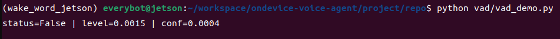
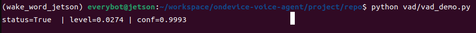

# VAD

이 디렉토리는 voice activity detection 모듈이다.

현재 상태:

- 요소기술 개발 완료
- wake word 이후 음성 구간 분리를 담당
- `webrtcvad`와 ONNX 기반 `Silero VAD`를 같은 사용법으로 갈아끼울 수 있게 정리
- 기본 backend는 `silero`로 확정
- 기본 마이크 기준 terminal demo 검증 완료

역할:

- wake word 이후 실제 발화 구간 검출
- STT 입력 구간 절단
- background noise 조건에서 불필요한 STT 호출 감소

현재 구현 구조:

- `detector.py`
  - 공통 진입점
  - `VADDetector(model="webrtcvad" | "silero")`
- `model_webrtcvad.py`
  - `webrtcvad` 기반 백엔드
- `model_silero.py`
  - ONNX Runtime 기반 Silero VAD 백엔드
- `vad_demo.py`
  - 기본 마이크를 받아 상태를 한 줄로 계속 표시하는 초간단 데모

## Jetson 터미널 스크린샷

| Idle 상태 | Speech 상태 |
|------|------|
|  |  |

설명:

- 왼쪽은 대기 상태다. `status=False`, 낮은 `level`, 거의 0에 가까운 `conf`가 보인다.
- 오른쪽은 발화가 들어온 상태다. `status=True`, 입력 레벨 상승, `silero`의 높은 `conf`를 바로 확인할 수 있다.
- 데모는 의도적으로 단순하게 유지해서, 기본 마이크와 backend 동작 상태를 즉시 확인하는 용도로 쓴다.

공통 사용 방식:

```python
from vad import VADDetector

detector = VADDetector(model="silero")
status = detector.infer(audio_chunk)
print(status)
print(detector.status)
```

기본값:

- `VADDetector()`는 현재 `silero`를 기본 백엔드로 사용한다
- `webrtcvad`는 비교/실험용 옵션으로 유지한다

백엔드 교체:

```python
detector = VADDetector(model="silero", model_path="vad/models/silero_vad.onnx")
```

demo 실행:

```bash
cd /home/everybot/workspace/ondevice-voice-agent/project/repo
source /home/everybot/workspace/ondevice-voice-agent/project/env/wake_word_jetson/bin/activate
python vad/vad_demo.py
```

Silero ONNX 모델:

- 기본 경로는 `vad/models/silero_vad.onnx`
- 공식 Silero VAD ONNX를 리포에 함께 둔다
- 공식 Silero VAD ONNX 파일을 위 경로에 두거나 `--model-path`로 직접 넘긴다
- 다운로드 절차는 [`models/README.md`](models/README.md)에 정리

현재 구현 기준:

- 프로젝트 기본 샘플레이트는 `16kHz mono`
- `infer(audio_chunk)`의 반환값은 현재 청크의 speech 여부 불리언
- `status`는 filtering 이후 최종 결과를 유지
- `raw_status`는 backend의 원시 판정 결과를 유지
- 기본 filtering 값:
  - `min_speech_frames=3`
  - `min_silence_frames=10`
- 데모는 현재 터미널에 아래를 한 줄로 갱신한다
  - 최종 `status`
  - 마이크 입력 레벨 `level`
  - `silero`일 때 실제 speech probability `conf`
  - `webrtcvad`일 때 raw frame 비율 `voiced_ratio`
- `webrtcvad` 경로는 기본 마이크 데모로 실제 동작 확인
- `silero` 경로는 공식 ONNX 파일 다운로드 후 기본 마이크 데모 동작 확인

현재 단계 판정:

- VAD 요소기술 개발 완료
- 남은 일은 wake word 뒤 연동과 speech start / speech end 기준 정리

다음 작업:

1. wake word 감지 직후 VAD가 자연스럽게 이어지도록 상위 연결 구조를 만든다
2. speech start / speech end / utterance cut 기준을 추가한다
3. 이후 STT 입력 구간 절단 기준으로 확장한다

현재 참고 기준:

- [`../docs/개발방침.md`](../docs/개발방침.md)
- [`../docs/project_overview.md`](../docs/project_overview.md)
- [`../docs/status.md`](../docs/status.md)
