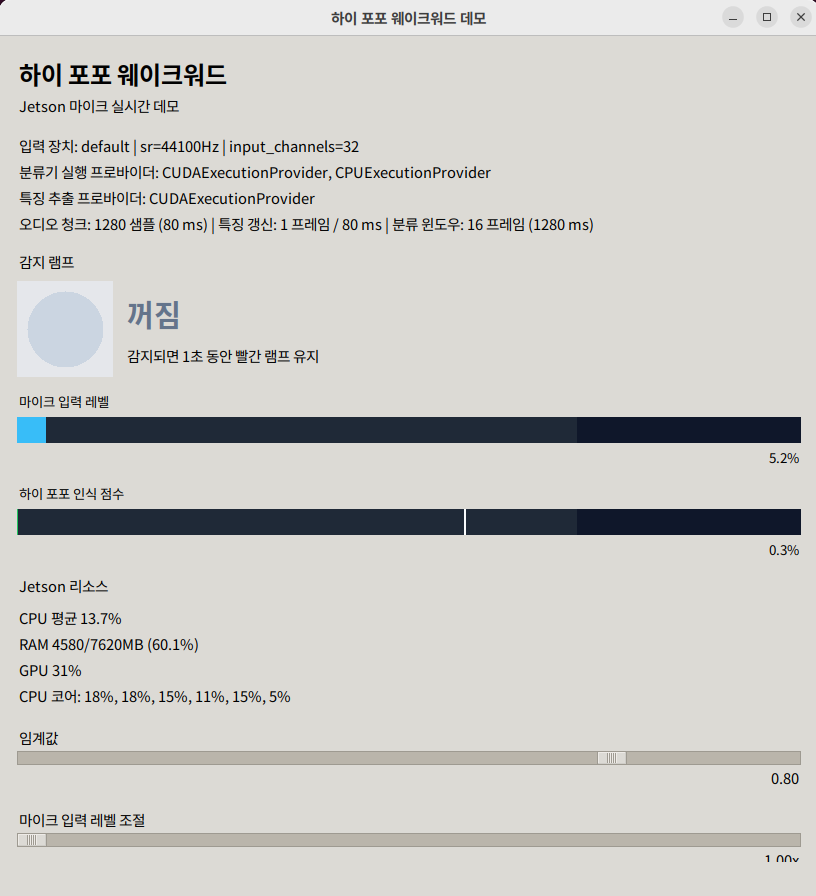
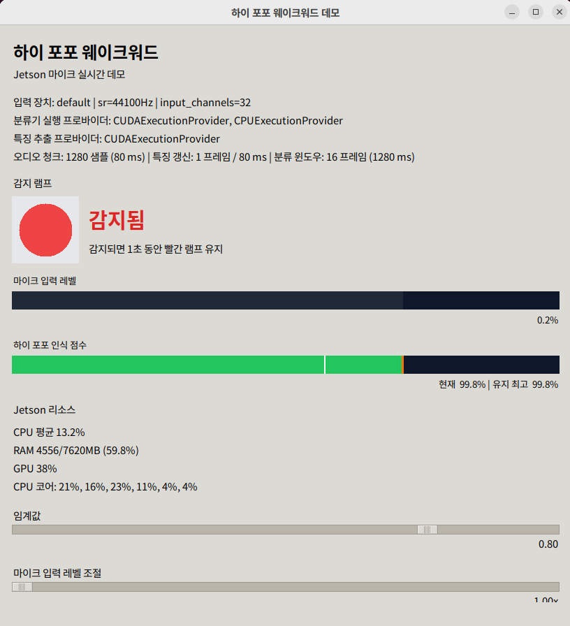
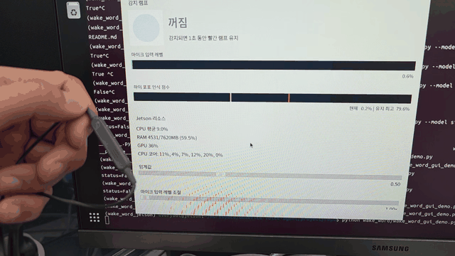

# Wake Word

이 디렉토리는 `하이 포포` 한국어 wake word 프로젝트의 실제 구현 영역이다.  
현재 이 리포에서 가장 많이 진행된 하위 프로젝트이며, 데이터 준비부터 feature extraction, 학습, 평가, Jetson 실시간 추론까지 이 디렉토리 아래에서 관리한다.

Wake word 문서 허브:

- 모듈 문서 허브: `docs/README.md`
- 현재 상태 기준: `../docs/status.md`

## 목표

- 호출어 `하이 포포`를 안정적으로 감지하는 경량 wake word 모델을 만든다.
- Linux 서버(A100)에서 학습하고 Jetson Orin Nano에서 ONNX 기반으로 실시간 추론한다.
- 실제 사용 환경에서 background 오탐과 호출어 미탐을 동시에 관리할 수 있는 수준까지 검증한다.

## 현재 상태

- positive 데이터 준비 완료
  - clean augmentation 완료
  - background mixed augmentation 완료
- negative 데이터 준비 완료
  - `AI Hub + MUSAN + FSD50K`
- feature extraction 완료
- baseline 학습 완료
- grid search 완료
- full-data 최종 학습 완료
- ONNX export 완료
- feature backbone ONNX 로컬 자산화 완료
- `openWakeWord` 로컬 clone 의존성 제거 완료
- Jetson 실시간 마이크 GUI demo 완료
- Jetson에서 실제 실행 확인 완료
- Jetson 학습 smoke env에서 `feature extraction -> train -> export` 최소 검증 완료
- `wake_word.py`를 `detector.py`로 정리 완료
- 현재 단계 판정
  - wake word 요소기술 개발 완료
  - 남은 일은 실기 튜닝과 상위 모듈 연동

## 현재 best 모델

- run: `final_full_best_trial40`
- artifact 설명:
  - [`models/hi_popo/README.md`](models/hi_popo/README.md)
- checkpoint 경로:
  - `models/hi_popo/runs/final_full_best_trial40/hi_popo_classifier.pt`
- 파라미터:
  - `lr=0.0005`
  - `negative_weight=5.0`
  - `layer_dim=64`
  - `n_blocks=2`

검증 결과:

- positive-only recall: `1177 / 1181 = 0.9966`
- negative-only false positive rate: `128 / 11250 = 0.0114`
- threshold: `0.80`

해석:

- 학습 파이프라인 기준으로는 매우 강한 후보다.
- 다만 이 수치는 held-out validation 기준이다.
- 실제 배치 성능은 Jetson 실기와 연속 배경 오디오 기준으로 다시 확인해야 한다.

## 구현 흐름

이 프로젝트는 openWakeWord의 구조를 참고하되, 현재 실행 코드는 이 리포 안의 로컬 구현만 사용한다.

원본 openWakeWord 출처와 현재 어떤 부분을 로컬로 옮겼는지는 아래 문서에 정리했다.

- [`../wake_word/docs/조사/260316_1231_OpenWakeWord_레퍼런스_조사.md`](../wake_word/docs/조사/260316_1231_OpenWakeWord_레퍼런스_조사.md)

1. positive 생성
2. positive augmentation
3. negative 준비
4. feature extraction
5. classifier 학습
6. 평가
7. ONNX export
8. Jetson 추론 검증

## Jetson GUI 스크린샷

| Idle 상태 | 감지 상태 |
|------|------|
|  |  |

설명:

- 왼쪽은 기본 대기 상태다. 감지 램프가 꺼져 있고, score bar와 Jetson 리소스 텍스트가 함께 보인다.
- 오른쪽은 `하이 포포` 감지 직후 상태다. 1초 유지 감지 램프, score peak, threshold 위치를 한 번에 확인할 수 있다.
- 두 화면 모두 실제 Jetson 마이크 입력 기준 GUI 데모 결과다.

## Jetson 데모 영상

[](../docs/assets/videos/jetson_demos/wake_word_gui_demo_jetson.mp4)

- 위 GIF를 클릭하면 음성 포함 원본 mp4가 열린다.
- 원본 파일: [Wake Word GUI 데모 영상 (mp4)](../docs/assets/videos/jetson_demos/wake_word_gui_demo_jetson.mp4)

## 디렉토리 구조

```text
wake_word/
├── README.md                 # 이 문서
├── train/                    # 학습/평가 스크립트
├── models/                   # 모델 아카이브
├── assets/feature_models/    # feature backbone ONNX 2개
├── examples/                 # 리포에 함께 두는 소량 샘플
├── features.py               # feature backbone 로컬 구현
├── detector.py               # 추론 모듈
├── wake_word_demo.py         # feature 입력용 CLI demo
└── wake_word_gui_demo.py     # 마이크 입력용 실시간 GUI demo
```

### `train/`

학습 파이프라인 스크립트를 단계별로 관리한다.

- [`train/01_generate_positive.py`](train/01_generate_positive.py)
- [`train/02_augment.py`](train/02_augment.py)
- [`train/02b_mix_background.py`](train/02b_mix_background.py)
- [`train/03_prepare_negative.py`](train/03_prepare_negative.py)
- [`train/04_extract_features.py`](train/04_extract_features.py)
- [`train/05_train.py`](train/05_train.py)
- [`train/05b_search.py`](train/05b_search.py)
- [`train/05c_evaluate.py`](train/05c_evaluate.py)
- [`train/06_export_onnx.py`](train/06_export_onnx.py)

### `models/`

모델과 실험 결과를 run 단위로 보관한다.

- [`models/hi_popo/README.md`](models/hi_popo/README.md)
- `runs/<run_name>/`
- `hi_popo_classifier.pt`
- `hi_popo_training_history.json`
- `hi_popo_latest_run.json`

### `examples/`

이 리포에 함께 둘 소량 샘플만 관리한다.

- [`examples/README.md`](examples/README.md)
- [`examples/audio_samples/README.md`](examples/audio_samples/README.md)

## 데이터 전략 요약

### Positive

- wake word: `하이 포포`
- synthetic TTS 기반 생성
- clean 증강과 background mixed 증강을 분리

현재 수량:

- clean: `11,250`
- mixed_noise: `281`
- mixed_speech: `281`

### Negative

최종 기준:

- AI Hub 자유대화 음성
- MUSAN
- FSD50K

최종 수량:

- `negative/musan`: `20,000`
- `negative/fsd50k`: `20,000`
- `negative/aihub_free_conversation`: `72,500`

### Feature

추출된 feature shape:

- positive train: `(10631, 28, 96)`
- positive test: `(1181, 28, 96)`
- negative train: `(101250, 28, 96)`
- negative test: `(11250, 28, 96)`

## 평가 관점

현재 코드에서 보고 있는 핵심 값은 아래 두 가지다.

- positive-only recall
- negative-only false positive rate

즉 아래 질문에 직접 대응한다.

- `하이 포포`를 불렀을 때 얼마나 잘 알아듣는가?
- background에서 얼마나 오탐이 나는가?

다만 현재 평가는 clip-level held-out validation 기준이다.  
실제 배치 관점에서는 아래가 추가로 필요하다.

- false accepts per hour
- 연속 오디오 기반 false positive 측정
- 실제 마이크 조건에서의 false reject 측정

## 남은 검증 및 연동 작업

1. 실제 현장 마이크와 실사용 거리 기준으로 threshold와 input gain 기본값을 확정
2. `하이 보보`, `하이 뽀뽀`, `굿바이 포포` 같은 hard negative 문구와 일반 대화로 오탐 패턴을 수집
3. idle/background 연속 재생 기준 false accepts per hour를 측정
4. 실기 결과에 따라 데이터 보강 또는 재학습 여부를 결정하고, 성능이 충분하면 상위 SDK 연결로 넘어간다

## ONNX export / Jetson 준비

현재 classifier는 ONNX export 가능하도록 정리돼 있다.

- export script:
  - [`train/06_export_onnx.py`](train/06_export_onnx.py)
- export 결과:
  - `models/hi_popo/hi_popo_classifier.onnx`
  - `models/hi_popo/hi_popo_classifier_onnx.json`
- ONNX wrapper:
  - [`detector.py`](detector.py)
- feature 입력용 CLI demo:
  - [`wake_word_demo.py`](wake_word_demo.py)
- 마이크 입력용 GUI demo:
  - [`wake_word_gui_demo.py`](wake_word_gui_demo.py)
- GUI 주요 표시:
  - score 게이지와 3초 유지 최고점
  - threshold 슬라이더
  - 마이크 입력 레벨 조절 슬라이더
  - 감지 시 1초 유지 램프
  - `tegrastats` 기반 CPU / RAM / GPU 텍스트
- GUI timing 표시:
  - `melspectrogram.onnx`
  - `embedding_model.onnx`
  - `hi_popo_classifier.onnx`
- 현재 간단 benchmark:
  - chunk `80 ms`
  - avg total pipeline `8.35 ms`

중요한 점:

- 현재 추론 체인은 `melspectrogram.onnx -> embedding_model.onnx -> hi_popo_classifier.onnx` 순서의 ONNX 연결이다.
- `melspectrogram.onnx`와 `embedding_model.onnx`는 `assets/feature_models/`에 함께 보관한다.
- export 대상 classifier는 여전히 `classifier only` ONNX이며, 입력은 raw audio가 아니라 feature다.
- wrapper는 `(16, 96)` window와 `(T, 96)` clip feature 둘 다 받을 수 있다.
- `detector.py`의 realtime 래퍼는 로컬 `features.py`를 통해 embedding 추출까지 함께 연결한다.
- `models/` 아래의 대용량 학습 산출물은 계속 git 제외 대상이다.
- 다만 현재 Jetson runtime 재현에 필요한 최종 classifier ONNX와 metadata는 소형 자산이라 리포에 함께 둔다.

예시:

```bash
python wake_word/train/06_export_onnx.py \
  --checkpoint wake_word/models/hi_popo/runs/final_full_best_trial40/hi_popo_classifier.pt

python wake_word/wake_word_demo.py \
  --model wake_word/models/hi_popo/hi_popo_classifier.onnx \
  --metadata wake_word/models/hi_popo/hi_popo_classifier_onnx.json \
  --providers cpu \
  --features /tmp/feature_clip.npy

source /home/everybot/workspace/ondevice-voice-agent/env/wake_word_jetson/bin/activate
python wake_word/wake_word_gui_demo.py \
  --model wake_word/models/hi_popo/hi_popo_classifier.onnx \
  --metadata wake_word/models/hi_popo/hi_popo_classifier_onnx.json \
  --feature-device gpu
```

## 관련 문서

- [`../docs/project_overview.md`](../docs/project_overview.md)
- [`../docs/status.md`](../docs/status.md)
- [`../docs/개발방침.md`](../docs/개발방침.md)
- [`../wake_word/docs/조사/260316_1230_웨이크워드_기술_조사.md`](../wake_word/docs/조사/260316_1230_웨이크워드_기술_조사.md)
- [`../docs/jetson_transition_plan.md`](../docs/jetson_transition_plan.md)
